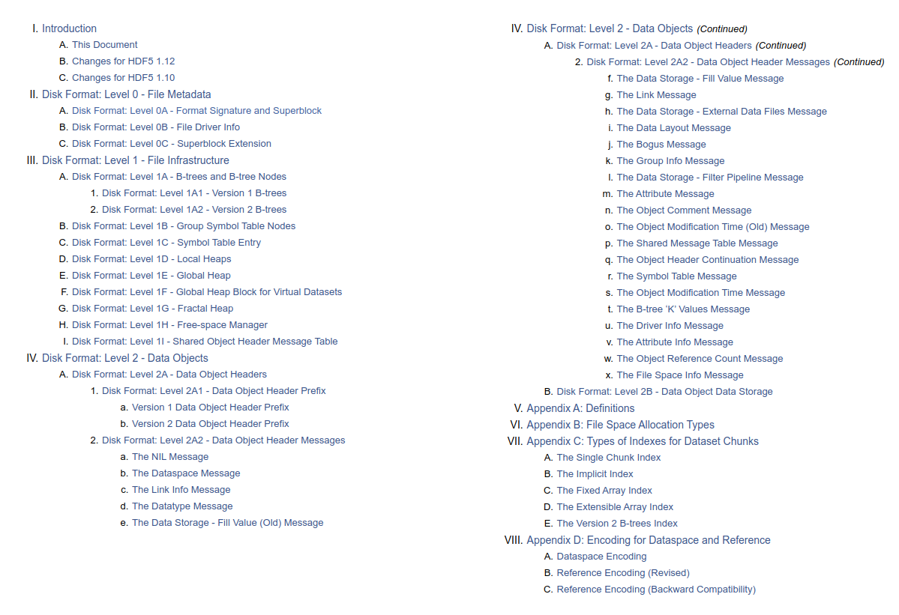
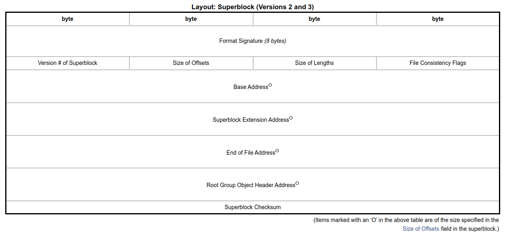
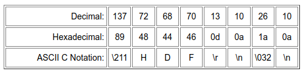

# HDF5.jl: Hierarchical Data Storage for Julia

Mark Kittisopikul (HHMI), Simon Byrne (Caltech), Mustafa Mohamad (UCalgary)

---

# What is HDF5?

HDF5 stands for Hierarchial Data Format version 5 and is maintained by The HDF Group, formerly part of the National Center for Supercomputing Appplications (NCSA).

* HDF5 is a file format with an open specification.
* HDF5 is a C Library and API.
* HDF5 is a data model.

---

# When to use HDF5

* Store numeric array and attributes in nested groups.
* Use it when you want to compactly store binary data.

## When not to use HDF5
* You have arrays of variable-length strings. Used fixed lengths strings instead.
* You have tables of heterogeneous data. Consider using columnar layouts. Other formats are more optimized for tables.

---

# Related formats

HDF5 is used as a base for other formats
* NetCDF - Network Common Data Form v4 (Unidata, UCAR)
* MAT - MATLAB data files v7.3+
* PyTables - Pandas
* JLD/JLD2 - Julia Data Format

---

# HDF5 Specification

The HDF5 specification is open and freely available.



https://docs.hdfgroup.org/hdf5/v1_14/_f_m_t3.html

---

# What is HDF5.jl?

HDF5.jl is a wrapper around the HDF5 C Library.

It consists of
* A low level interface, a direct mapping to the C API
* A mid level interface, lightweight helpers
* A high level interface, a Julia API
<!-- give examples ? -->

---

# Related Julia Packages

* HDF5_jll.jl, C Library from HDF Group (dependency of HDF5.jl)
* MAT.jl, MATLAB files (depends on HDF5.jl)
* JLD.jl, Julia Data Format (depends on HDF5.jl)
* JLD2.jl, Julia Data Format 2: pure Julia implementation of a subset of HDF5
* NetCDF.jl & NCDatasets.jl: wrappers for the NetCDF C library, which incorporates HDF5

---

# HDF5.jl Early and Recent Contributors

* There are many contributors
* Konrad Hisen initiated Julia's support for HDF5
* Tim Holy and Simon Kornblith were the initial primary authors
* Tom Short, Blake Johnson, Isaih Norton, Elliot Saba, Steven Johnson, Mike Nolta, Jameson Nash
* Justin Willmert improved many aspects C to Julia API interface
* Other recent contributors: t-bltg, Hendrik Ranocha, Nathan Zimmerberg, Joshua Lampert, Tamas Gal, David MacMahon, Juan Ignacio Polanco, Michael Schlottke-Lakemper, linwaytin, Dmitri Iouchtchenko, Lorenzo Van Munoz, Jared Wahlstrand, Julian Samaroo, machakann, James Hester, Ralph Kube, Kristoffer Carlsson

---

# HDF5.jl Current Developers

* Mustafa Mohamad, Mark Kittisopikul, and Simon Byrne are the current maintainers
* Mark Kittisopikul has been expanding API coverage, especially with chunking
* Simon Byrne has been working on package organization, filter interface, virtual datasets, and parallelization

## Special mention
- Erik Schnetter for building HDF5 in Yggdrasil

---

# What advantages does Julia bring to HDF5.jl?

<!--reorder-->

* HDF5.jl dynamically create types to match the stored HDF5 types.
* HDF5.jl can use Julia's reflection capabilities to create corresponding HDF5 types.
* HDF5.jl is easily extensible using multiple dispatch.
* HDF5.jl can create callbacks for C for efficient iteration.
* HDF5.jl wraps the C library directly in Julia via `@ccall`.
    * This is partially automated via Clang.jl and https://github.com/mkitti/LibHDF5.jl .

---

# Basic HDF5.jl Usage

```julia
using HDF5

# Write a HDF5 file
h5open("mydata.h5", "w") do h5f
    # Store an array
    h5f["group_A/group_B/array_C"] = rand(1024,1024)
    # Store an attribute
    attrs(h5f["group_A"])["access_date"] = "2023_07_21"
end

# Read a HDF5 file
C = h5open("mydata.h5") do h5f
    # Access an attribute
    println(attrs(h5f["group_A"])["access_date"])
    # Load an array and return it as C
    h5f["group_A/group_B/array_C"][:,:]
end
```

---

# Exploring a HDF5 file with HDF5.jl

```julia
julia> h5f = h5open("mydata.h5")
🗂️ HDF5.File: (read-only) mydata.h5
└─ 📂 group_A
   ├─ 🏷️ access_date
   └─ 📂 group_B
      └─ 🔢 array_C

julia> C  = h5f["group_A"]["group_B"]["array_C"][1:16,1:16]
16×16 Matrix{Float64}:
...

julia> close(h5f)
```

---

# Structs and HDF5 Types

```julia
julia> struct Foo
           x::Int64
           y::Float64
       end

julia> HDF5.datatype(Foo)
HDF5.Datatype: H5T_COMPOUND {
      H5T_STD_I64LE "x" : 0;
      H5T_IEEE_F64LE "y" : 8;
   }
```

---

# Reading and writing structs

```julia
julia> h5open("mystruct.h5", "w") do h5f
           h5f["Foo"] = [Foo(1, 3.0)]
       end
1-element Vector{Foo}:
 Foo(1, 3.0)

julia> h5open("mystruct.h5", "r") do h5f
           h5f["Foo"][]
       end
1-element Vector{NamedTuple{(:x, :y), Tuple{Int64, Float64}}}:
 (x = 1, y = 3.0)

julia> h5open("mystruct.h5", "r") do h5f
           read(h5f["Foo"], Foo)
       end
1-element Vector{Foo}:
 Foo(1, 3.0)
```

---

# Chunking and Built-in Gzip Compression Usage

In HDF5.jl version 0.16 we introduced a new general filter keyword allowing for the definition of filter pipelines.
```julia
using HDF5

h5open("simple_chunked.h5", "w", libver_bounds=v"1.12") do h5f
    h5ds = create_dataset(h5f, "gzipped_data", UInt8, (16,16),
        chunk=(4,4),
        filters=[HDF5.Filters.Deflate()],
        alloc_time = :early
    )
end
```

---

# Compression Filter Plugin Packages

<!--During the talk explain what these do and when/why you would want to use them-->

Glue code written in Julia.

* H5Zblosc.jl - Blosc.jl (Thank you, Steven G. Johnson)
* H5Zzstd.jl - CodecZstd.jl
* H5Zlz4.jl - CodecLZ4.jl
* H5Zbzip2.jl - CodecBzip2.jl
* H5Zbitshuffle.jl

Future: Let's figure out how to share these with JLD2.jl!

---

# Chunking and Filter Plugin Usage

```julia
using HDF5, H5Zzstd

h5open("zstd_chunked.h5", "w", libver_bounds=v"1.12") do h5f
    h5ds = create_dataset(h5f, "zstd_data", UInt8, (16,16),
        chunk=(4,4),
        filters=[ZstdFilter(3)]
    )
end
```

TODO: Use a package extension loading mechanism when CodecZstd.jl is present.

---

# Using External Native Plugin Filters

The HDF5 C library has a filter plugin mechanism. Plugins are shared libraries located in `/usr/local/hdf5/lib/plugin` or as specified by `$HDF5_PLUGIN_DIR`.

```julia
using HDF5.Filters

bitshuf = ExternalFilter(32008, Cuint[0, 0])
bitshuf_comp = ExternalFilter(32008, Cuint[0, 2])

data_A = rand(0:31, 1024)
data_B = rand(32:63, 1024)

filename, _ = mktemp()
h5open(filename, "w") do h5f
    # Indexing style
    h5f["ex_data_A", chunk=(32,), filters=bitshuf] = data_A
    # Procedural style
    d, dt = create_dataset(h5f, "ex_data_B", data_B, chunk=(32,), filters=[bitshuf_comp])
    write(d, data_B)
end
```
---

# New with HDF5 1.12.3 and 1.14.0: Efficient Chunk Based Iteration

Where are the compressed chunks and can we decompress them in parallel? 

| N Chunks | H5Dchunk_iter | H5Dget_chunk_info | Ratio |
|---|---|---|---|
| 64 | 2e-4 s | 5e-4 s | 2.4 |
| 256 | 7e-4 s | 5e-3 s | 6 |
| 1024 | 3e-3 s | 5e-2 s | 16 |
| 4096 | 1e-2 s | 7e-1 s | 57 |
| 16384 | 6e-2 s | 1e2 s | 208 |

---

# The HDF5 C API does not allow for multithreaded concurrency

* The HDF5 C library is not directly compatible with multithreading for parallel I/O. The preferred parallelization is via MPI.
* There is a `H5_HAVE_THREADSAFE` compile time option that uses a recursive lock.
* In HDF5.jl we have applied a `ReentrantLock` on all API calls.
  * It is now safe to use HDF5.jl with multithreading, but you may not see much of an improvement.

---

# Virtual datasets

- Maps multiple datasets into a single dataset
  - Can be same or different files
  - Supports patterns for sequentially numbered files/datasets

- e.g. consider a dataset made up of 100&times;10 blocks, across 4 files
  - `data00.h5`, `data01.h5`, etc.

```julia
space = dataspace((100,40))
create_dataset(h5f, "dataset", datatype, space;
    virtual=[HDF5.VirtualMapping(
        HDF5.hyperslab(space, (1:100, HDF5.BlockRange(1:10; count = -1))), # block pattern
        "./data0%b.h5",       # filenames (%b block pattern)
        "data",               # path to source dataset in file
        dataspace((100,10))   # view into source dataset
    )]
)
```

---

# Parallelization via MPI

- Message Passing Interface (MPI) is an interface for single-program, multiple-data (SPMD) parallelism.
  - Launch multiple processes running the same program
    ```sh
     mpiexec -n <nprocs> program ...
     ```
  - Programs determine what they should do based on their identifier (_rank_).
  - Each process determines what communication operations it should do (messages)
   - Multiple implementations (Open MPI, MPICH, vendor-specific)
   - Widely used in HPC for large-scale distributed parallelism.
- MPI.jl provides Julia bindings

---
## Using MPI + HDF5

Load and initialize MPI
```julia
using MPI, HDF5
MPI.Init()
```

Pass MPI communicator to `h5open`, e.g.
```julia
h5 = h5open("data.h5", "w", MPI.COMM_WORLD)
```
- Needs to be _collective_ (all processes at the same time), with the same arguments.
- File needs to be on accessible from all processes (e.g. on a shared file system if distributed).

---

Usage otherwise same as normal:
- metadata operatrions(`create_dataset`, writing attributes) should be done collectively, with the same arguments.
- reading/writing data can be independently per-process.
  - try to align chunks with processes
  - if collective, use `dxpl_mpio=:collective` option with `create_dataset`/`open_dataset`
- some limitations (e.g no datasets with variable-length strings).

---

# Configuring HDF5 (in upcoming 0.17 release)

- May want to use specific HDF5 library
  - interoperability with other languages (e.g. h5py)
  - linked against custom MPI binary
  - specific hardware features (burst buffers)

- Preferences.jl to specify custom HDF5 binary
```julia
using Preferences, HDF5
set_preferences!(HDF5,
        "libhdf5" => "/path/to/your/libhdf5.so",
        "libhdf5_hl" => "/path/to/your/libhdf5_hl.so",
        force = true)
```

---

# Applications

* CliMa
* Plots.jl backend
* JLD.jl (dependency) and JLD2.jl (interop reference)
* Checkpointing.jl

---

# Summary

* HDF5 is a format, C library, and data model for storing hierarchical information.
* HDF5.jl is a wrapper providing high and low level access to the HDF5 library.
* HDF5.jl now allows for multithreaded capability through locks and may expand capabilities beyond that of HDF5 C library
* HDF5.jl works with MPI.jl to allow for distributed multiprocessing

---

# Questions?

---

# Extra Slides and Advanced Topics
* HDF5 Specification: Superblock and Hex Dump
* Iteration

---

# HDF5 Specification: Superblock

HDF5 structures are variably sized and use Bob Jenkin's Lookup3 checksum for metadata integrity.



https://docs.hdfgroup.org/hdf5/v1_14/_f_m_t3.html#Superblock

---

# A HDF5 Hex Dump

<!--Move to the end-->

```
00000000  89 48 44 46 0d 0a 1a 0a  03 08 08 00 00 00 00 00  |.HDF............|
00000010  00 00 00 00 ff ff ff ff  ff ff ff ff 82 08 01 00  |................|
00000020  00 00 00 00 30 00 00 00  00 00 00 00 92 3c c0 2c  |....0........<.,|
00000030  4f 48 44 52 02 20 a3 5c  ae 64 a3 5c ae 64 a3 5c  |OHDR. .\.d.\.d.\|
00000040  ae 64 a3 5c ae 64 78 02  12 00 00 00 00 ff ff ff  |.d.\.dx.........|
00000050  ff ff ff ff ff ff ff ff  ff ff ff ff ff 0a 02 00  |................|
00000060  01 00 00 06 14 00 00 01  00 09 7a 61 72 72 73 68  |..........zarrsh|
00000070  61 72 64 c3 00 00 00 00  00 00 00 00 40 00 00 00  |ard.........@...|
00000080  00 00 00 00 00 00 00 00  00 00 00 00 00 00 00 00  |................|
```



---

# Iteration

<!--move to end-->

For accessing data has two kinds of interfaces for accessing enumerated data:
1. `h5a_get_name_by_idx(loc_id, obj_name, index_type, order, idx, name, size, lapl_id)`
2. `h5a_iterate(obj_id::hid_t, idx_type::Cint, order::Cint, n::Ptr{hsize_t}, op::Ptr{Cvoid}, op_data::Any)`, `op` is function pointer

The `_by_idx` calls are easy to use via a simple `for` loop but are very inefficient for iterating over many items.

The `_iterate` calls require a C callback, `op`, and can be challenging to use but are efficient.

Based on `h5a_iterate` we have created a new `attrs` API replacing the former `attributes` API.

---

# Concurrency with Direct I/O

* The HDF5 C library provides byte offsets for continguous and chunked datasets
* Currently, HDF5.jl allows contiguous datasets to be memory mapped into arrays allowing for multithreaded reads.
* With efficient chunk iteration, could we perform parallel decompression in HDF5.jl by reading compressed chunks directly?
