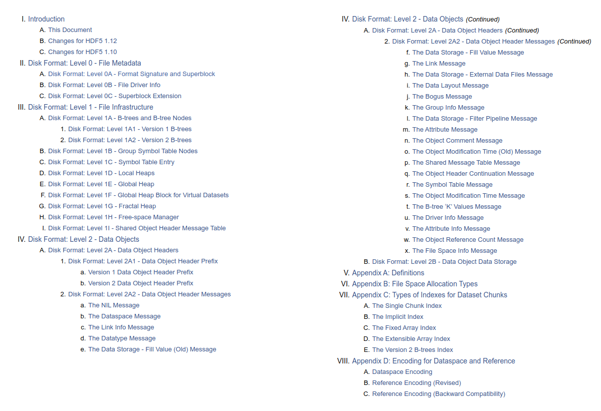
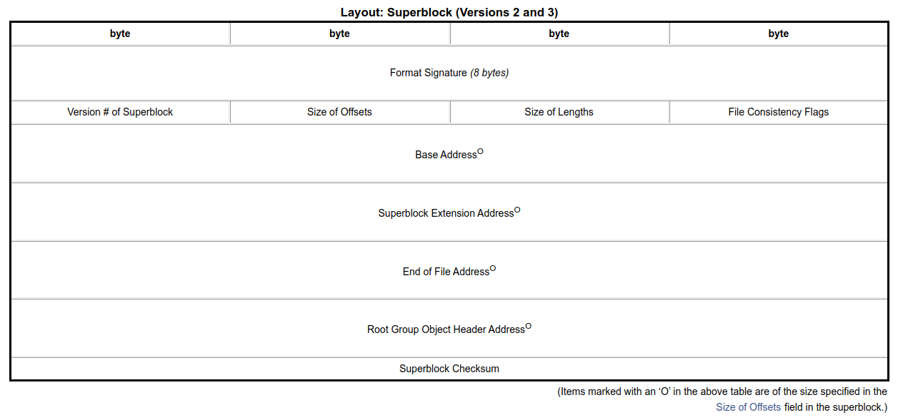
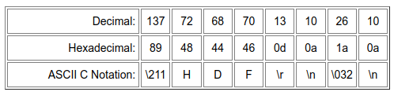

# HDF5.jl: Hierarchical Data Storage for Julia

Mark Kittisopikul, Simon Byrne, Mustafa Mohamad

---

# To Simon and Mustafa

I'm using https://marp.app/
If you use VS Code, I recommend getting the Marp VS Code Extension
https://marketplace.visualstudio.com/items?itemName=marp-team.marp-vscode

From VS Code you can do Ctrl-Shift-V to view a PDF preview of the slide deck
Also see "Marp: Export slide deck" to save a PDF

---

# What is HDF5?

HDF5 stands for Hierarchial Data Format version 5 and is maintained by The HDF Group.

* HDF5 is a file format with an open specification
* HDF5 is a C Library and API
* HDF5 is a data model

---

# When to use HDF5

* Store numeric array and attributes in nested groups
* Use it when you want to compactly store lot of binary data

## When not to use HDF5
* Arrays of variable-length strings
* Tables of heterogeneous data

---

# Related formats

HDF5 is used as a base for other formats
* NetCDF - Network Common Data Form v4 (Unidata, UCAR)
* MAT - MATLAB data files v7.3+
* PyTables - Pandas

---

# HDF5 Specification



https://docs.hdfgroup.org/hdf5/v1_14/_f_m_t3.html

---

# HDF5 Specification: Superblock



https://docs.hdfgroup.org/hdf5/v1_14/_f_m_t3.html#Superblock

---

# A HDF5 Hex Dump

```
00000000  89 48 44 46 0d 0a 1a 0a  03 08 08 00 00 00 00 00  |.HDF............|
00000010  00 00 00 00 ff ff ff ff  ff ff ff ff 82 08 01 00  |................|
00000020  00 00 00 00 30 00 00 00  00 00 00 00 92 3c c0 2c  |....0........<.,|
00000030  4f 48 44 52 02 20 a3 5c  ae 64 a3 5c ae 64 a3 5c  |OHDR. .\.d.\.d.\|
00000040  ae 64 a3 5c ae 64 78 02  12 00 00 00 00 ff ff ff  |.d.\.dx.........|
00000050  ff ff ff ff ff ff ff ff  ff ff ff ff ff 0a 02 00  |................|
00000060  01 00 00 06 14 00 00 01  00 09 7a 61 72 72 73 68  |..........zarrsh|
00000070  61 72 64 c3 00 00 00 00  00 00 00 00 40 00 00 00  |ard.........@...|
00000080  00 00 00 00 00 00 00 00  00 00 00 00 00 00 00 00  |................|
```



---

# What is HDF5.jl?

HDF5.jl is a wrapper around the HDF5 C Library.

It consists of
* A low level interface, a direct mapping to the C API
* A mid level interface, lightweight helpers
* A high level interface, a Julia API

---

# HDF5.jl Early Contributors

* There are many contributors
* Konrad Hisen initiated Julia's support for HDF5
* Tim Holy and Simon Kornblith were the initial primary authors
* Tom Short, Blake Johnson, Isaih Norton, Elliot Saba, Steven Johnson, Mike Nolta, Jameson Nash

---

# HDF5.jl Current Developers

* Mustafa Mohamad is the current lead maintainer 
* Mark Kittisopikul has been expanding API coverage, especially with chunking
* Simon Byrne has been working on package organization, filter interface, virtual datasets, and parallelization
* Other recent contributors: t-bltg, Henrik Ranocha, Nathan Zimmerberg, Joshua Lampert, Tamas Gal, David MacMahon, Juan Ignacio Polanco, Michale Schlottke-Lakemper, linwaytin, Dmitri Iouchtchenko, Lorenzo Van Munoz, Jared Wahlstrand, Julian Samaroo, machakann, James Hester, Ralph Kube, Kristoffer Carlsson

---

# How does HDF5.jl compare to h5py?

* h5py is a Python library that wraps the HDF5 C library.
* h5py uses Cython to build low-level wrappers
* HDF5.jl wraps the C library directly via `@ccall`
* HDF5.jl takes advantages of types and multiple dispatch

---

# Basic HDF5.jl Usage

```julia
using HDF5

# Write a HDF5 file
h5open("mydata.h5", "w") do h5f
    h5f["group_A/group_B/array_C"] = rand(1024,1024)
    attrs(h5f["group_A"])["access_date"] = "2023_07_21"
end

# Read a HDF5 file
C = h5open("mydata.h5") do h5f
    println(attrs(h5f["group_A"])["access_date"])
    h5f["group_A/group_B/array_C"][:,:]
end
```

---

# Exploring a HDF5 file with HDF5.jl

```julia
julia> h5f = h5open("mydata.h5")
🗂️ HDF5.File: (read-only) mydata.h5
└─ 📂 group_A
   ├─ 🏷️ access_date
   └─ 📂 group_B
      └─ 🔢 array_C

julia> C  = h5f["group_A"]["group_B"]["array_C"][1:16,1:16]
16×16 Matrix{Float64}:
...

julia> close(h5f)
```

---

# Structs and HDF5 Types

```julia
julia> struct Foo
           x::Int64
           y::Float64
       end

julia> HDF5.datatype(Foo)
HDF5.Datatype: H5T_COMPOUND {
      H5T_STD_I64LE "x" : 0;
      H5T_IEEE_F64LE "y" : 8;
   }
```

---

# Reading and writing structs

```julia
julia> h5open("mystruct.h5", "w") do h5f
           h5f["Foo"] = [Foo(1, 3.0)]
       end
1-element Vector{Foo}:
 Foo(1, 3.0)

julia> h5open("mystruct.h5", "r") do h5f
           h5f["Foo"][]
       end
1-element Vector{NamedTuple{(:x, :y), Tuple{Int64, Float64}}}:
 (x = 1, y = 3.0)

julia> h5open("mystruct.h5", "r") do h5f
           read(h5f["Foo"], Foo)
       end
1-element Vector{Foo}:
 Foo(1, 3.0)
```

---

# Compression Filter Plugin Packages

Glue code written in Julia.

* H5Zblosc.jl - Blosc.jl (Thank you, Steven G. Johnson)
* H5Zzstd.jl - CodecZstd.jl
* H5Zlz4.jl - CodecLZ4.jl
* H5Zbzip2.jl - CodecBzip2.jl
* H5Zbitshuffle.jl

---

# Chunking and Built-in Gzip Compression Usage

```julia
using HDF5

h5open("simple_chunked.h5", "w", libver_bounds=v"1.12") do h5f
    h5ds = create_dataset(h5f, "gzipped_data", UInt8, (16,16),
        chunk=(4,4),
        filters=[HDF5.Filters.Deflate()],
        alloc_time = :early
    )
end
```

---

# Chunking and Filter Plugin Usage

```julia
using HDF5, H5Zzstd

h5open("zstd_chunked.h5", "w", libver_bounds=v"1.12") do h5f
    h5ds = create_dataset(h5f, "zstd_data", UInt8, (16,16),
        chunk=(4,4),
        filters=[ZstdFilter(3)]
    )
end
```

Future: Loading CodecZstd.jl will trigger a package extension

---

# Other Related Julia Packages

* HDF5_jll.jl, C Library from HDF Group
* MAT.jl, MATLAB files
* JLD.jl, Julia Data Format
* JLD2.jl, Julia Data Format 2, Pure Julia implementation

---

# Parallelization via Message Passing Interface (MPI)

<!--Simon Byrne, please elaborate-->

---